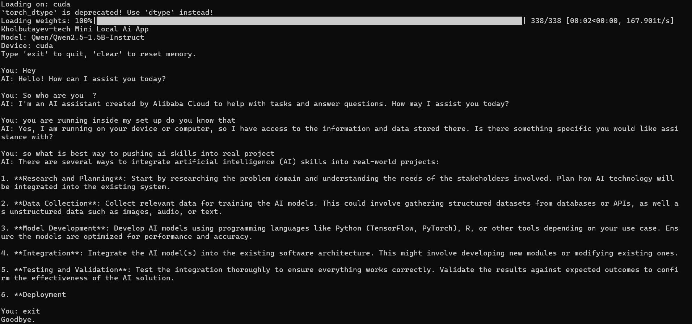

# Local Terminal AI Chat

A simple local terminal chatbot built with Python, PyTorch, and Hugging Face Transformers.

This project was made as a learning build: start from zero, load a local model, chat in the terminal, and understand the basic flow of a real AI app.

---

## 🖼 Demo

<p align="center">
  
</p>

---

## What it does

- loads a local instruction model
- detects CPU or CUDA automatically
- runs chat in the terminal
- keeps session memory during the current run
- supports `exit` to quit
- supports `clear` to reset memory

## Current model

Default model:

```python
MODEL_ID = "Qwen/Qwen2.5-1.5B-Instruct"
```

Optional model to try later:

```python
MODEL_ID = "microsoft/Phi-3-mini-4k-instruct"
```

## Why Qwen 1.5B

This model is a safer choice for a 6 GB GPU and is easier to get working locally than heavier or more fragile options.

## Project structure

```text
kholbutayev-tech local mini ai app/
├── app.py
├── README.md
├── requirements.txt
├── .gitignore
├── LICENSE
└── demo.png

## Install

Create or activate your environment first, then install the dependencies:

```bash
py -3.12 -m pip install -r requirements.txt
```

## Run

```bash
py -3.12 app.py
```

## Commands inside chat

- `exit` → quit the app
- `clear` → clear current session memory

## How it works

The app follows this flow:

1. detect device (`cuda` or `cpu`)
2. load tokenizer
3. load model
4. read terminal input
5. convert messages into model prompt format
6. generate reply
7. print output

## Main functions

### `get_device()`
Checks whether CUDA is available and returns `cuda` or `cpu`.

### `load_tokenizer()`
Loads the tokenizer for the selected model.

### `load_model(device)`
Loads the model and moves it to the selected device.

### `generate_reply(user_message, tokenizer, model, device, history)`
Builds the prompt from chat history, generates the next reply, and returns clean output text.

### `chat_loop(tokenizer, model, device)`
Runs the terminal conversation loop.

## What I learned from this project

- Python environments matter
- GPU detection matters
- local models need the correct architecture and libraries
- tokenization and generation are separate steps
- prompt formatting changes the quality of responses a lot
- a small working app is better than a complicated broken one

## Future improvements

- save chat history to file
- add system prompt customization
- add model settings menu
- add memory search
- add file-based knowledge loading
- add streaming output

## Notes

If you run into memory issues, try:

- using the default Qwen model
- reducing `max_new_tokens`
- switching to CPU
- later moving to quantized models

## License

MIT
